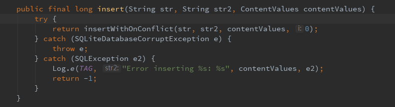
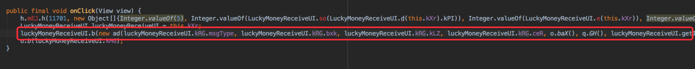
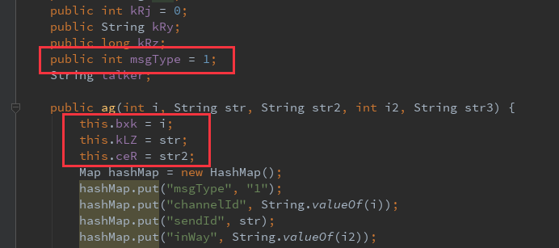
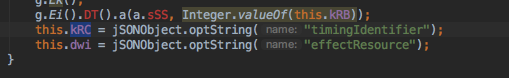
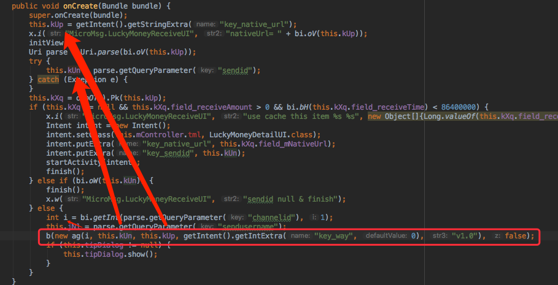
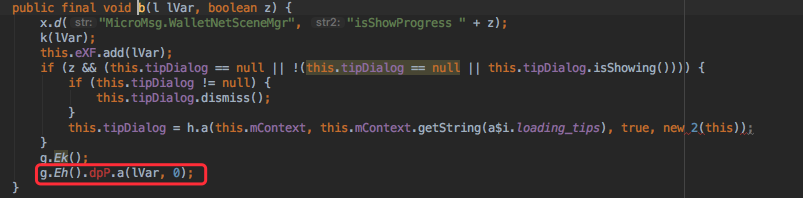
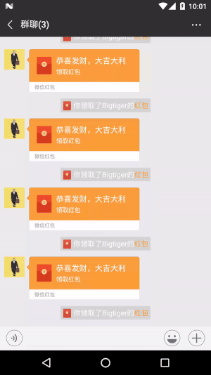

# 100行代码实现快到令人发指的微信抢红包插件


## 1.Frida简介

在实现实现微信抢红包插件之前，请允许我隆重介绍一下插件用到的框架，本插件是基于Hook框架frida。
frida是一款基于python + javascript 的hook框架， 通杀android\ios\linux\win\osx等各平台， 主要使用动态二进制插桩技术。

#### 插桩技术

插桩技术是将额外的代码注入程序中以收集运行时的信息，可分为两种：

（1）源代码插桩（Source Code Instrumentation(SCI)）：额外代码注入到程序源代码中。

（2）二进制插桩（Binary Instrumentation(BI)）：额外代码注入到二进制可执行文件中。

- 静态二进制插桩：在程序执行前插入额外的代码和数据，生成一个永久改变的可执行文件。  
- 动态二进制插桩：在程序运行时实时地插入额外代码和数据，对可执行文件没有任何永久改变。


### 你能用DBI做些什么呢？

- 访问进程的内存  
- 在应用程序运行时覆盖一些功能  
- 从导入的类中调用函数  
- 在堆上查找对象实例并使用这些对象实例  
- Hook，跟踪和拦截函数等等


## 2.Frida的安装

今天我们用到的Frida框架分为两部分： 一部分是运行在系统上的交互工具frida CLI; 另一部分是运行在目标机器上的代码注入工具 frida-server。

### frida CLI：     

环境要求： 

- 系统环境 - Windows, macOS, or GNU/Linux   
- Python – 最新的3.x版本

通过 pip 安装frida

```
$ pip install frida
```

> 说明： 
> (1) 通过pip安装的frida是可以跟python绑定的； 另外 frida 现在也已经有了跟nodeJs绑定的版本， 因此也可以直接通过 npm 进行安装。  
> (2) `frida CLI`是安装的`frida`的其中一个工具，也是最常用的一个工具。

### frida server  

`frida-server`需要我们单独下载，
在 frida的 [github: https://github.com/frida/frida/releases](https://github.com/frida/frida/releases)  上可以直接下载对应系统已经编译好的 `frida server`

我们需要下载的文件名的格式是： `frida-server-(version)-(platform)-(cpu).xz`  

我试验的手机是nexus6p, cpu是arm64；

所以我需要下载的是： `frida-server-11.0.13-android-x86_64.xz`

> 注意， frida-server 的版本一定要跟 frida CLI的版本一致

将下载后的压缩包解压得到 `frida-server`, 然后将该文件推送到Android设备上

```
$ adb push path/to/frida-server /data/local/tmp/ 
```

将android设备上的`frida-server`添加执行权, 并运行该程序(需要root权限)

```
$ adb shell
$ cd /data/local/tmp
$ su
# chmod +x frida-server
# ./frida-server &
```	

### frida tools


前面说过， `frida CLI`只是`frida`的其中一个工具， `frida` 的工具有6个：

（1） frida CLI: 是一个交互式解释器（REPL），他的交互形式跟IPython很类似   

	# 连接frida, 并注入到设备上的chrome应用的进程上
	$ frida -U com.android.chrome

	# 连接frida, 并将test.js文件注入到设备上的chrome应用的进程上
	$ frida -U com.android.chrome -l test.js


（2） frida-ps: 用于列出进程的一个命令行工具，当我们需要跟远程系统进行交互的时候，这个是非常有用的   


	# 连接frida到一个USB设备上,同时列出该设备上运行中的进程
	$ frida-ps -U
	
	# 列出运行中的程序
	$ frida-ps -Ua
	
	# 列出安装的程序
	$ frida-ps -Uai
	
	# 连接frida到一个指定的设备上
	$ frida-ps -D 0216027d1d6d3a03

另外还有四个分别是： `frida-trace`, `frida-discover`, `frida-ls-devices`, `frida-kill`  
由于不是经常用到，也限于篇幅的原因这边就不一一的详细介绍了， 感兴趣的同学可以去frida的官网查看他们的详细介绍和用法。 


### Java Api
	
另外，在Hook开始之前， 我还是需要对Java注入相关的api做一个简单的介绍， frida的注入脚本是JavaScript， 因此我们后面都是通过js脚本来操作设备上的Java代码的。

	//确保我们的线程附加到Java的虚拟机上， fn 是附加成功之后的回调， 之后我们的操作都必须在这个回调里面进行， 这也是frida的硬性要求
	Java.perform(fn)
	
	//动态获取一个JS包装了的Java类，然后我们就可以通过$new方法来调用这个类构造方法。
	Java.use(className)  
		$new() 
		$dispose() //最后我们可以通过$dispose()方法来清空这个JS对象

	//将JS包装类的实例handle转换成另外一种JS包装类klass
	Java.cast(handle, klass)

当我们获取到Java类之后， 我们直通过接 `<wrapper>.<method>.implementations = function() {}`的方式来hook`wrapper`类的method方法，不管是实例方法还是静态方法都可以。  

由于js代码注入的时候可能会出现超时的错误， 为了防止这个问题，我们通常还需要在最外面包装一层`setImmediate(function(){})`的代码；


下面就是js的一个模板代码：

```
setImmediate(function() {
	Java.perform(function() {
		// start hook
		...
	}
});
```

## 3. Start Hook

由于本文的主旨是教大家如何使用强大的frida框架， 所以侧重描述的是frida的使用， 而不会说明如何逆向微信。

### (1) 信息持久化到本地的拦截

微信的每一条信息都会保存到本地数据库，这个保存的方法就是 `com.tencent.wcdb.database.SQLiteDatabase` 类的 `insert()`方法：



我们先看看每条信息保存的内容是什么：

```
var SQL = Java.use("com.tencent.wcdb.database.SQLiteDatabase");
var Set = Java.use("java.util.Set");
var ContentValues = Java.use("android.content.ContentValues");

//替换SQL的insert方法的实现
SQL.insert.implementation = function(arg1, agr2, arg3) {
	this.insert(arg1, arg2, arg3);	//先调用原来的方法，让数据正确保存
	console.log("[insert] -> arg1: " + arg1 +"\r arg2: " +arg2);

	//通过frida得到的Java对象都是Object类， 所以我们通常都要做一次转换
	var values = Java.cast(arg3, ContentValues);	
	var sets = Java.cast(values.keySet(), Set);

	var arr = sets.toArray().toString().split(",");	//先得到ContentValues中所有的key
	for (var i = 0; i < arr.length; i++) {
		console.log("[insert] -> key: " + arr[i]+"   value:" + values.get(arr[i]));
	}
}
```

我们将手机连接到电脑， 让后通过frida将脚本注入到微信中：

```
$ frida -U -l luckymoney.js com.tencent.mm
```

用微信发送任意消息， 我们可以看到控制台打印内容如下：

	[insert] -> arg1: message
	 arg2: msgId
	[insert] -> key: msgId   value:91
	[insert] -> key: status   value:1
	[insert] -> key: createTime   value:1530861366118
	[insert] -> key: talker   value:7669555261@chatroom
	[insert] -> key: content   value:vg
	[insert] -> key: type   value:1
	[insert] -> key: isSend   value:1
	[insert] -> key: bizChatId   value:-1
	[insert] -> key: talkerId   value:51

arg1就是要插入数据的表名， arg2表的主键， arg3是要插入表的数据的字段名称跟值的集合。
这样， 我们就可以轻松拿到每条消息的内容和发送者等相关信息

这里我们需要注意的是arg3里面以下几个值:

key | 说明
--- | ---
status | 消息状态
talker | 消息发送者标志, 群消息都会以`@chatroom`结尾
content | 消息具体内容
isSend | 当消息是自己发送的时候, 该值为0
type | 消息类型, 红包消息为 436207665

当我们接收到一条红包消息的时候，我们可以看到红包信息的具体内容如下:

```
<msg>
	<appmsg appid="" sdkver="">
		<des><![CDATA[我给你发了一个红包，赶紧去拆!]]></des>
		<url><![CDATA[https://wxapp.tenpay.com/mmpayhb/wxhb_personalreceive?showwxpaytitle=1&msgtype=1&channelid=1&sendid=1000039501201807087021223013285&ver=6&sign=2b16413b77ea0565960dbf9b6bb782b57e47bdc10213b5b0f7babcac19c344dc6f5249484e360f65ee2ab3c31b1e0589cce15f82241d9019c9227459a22cf055ecb6f1a3700d06d90e0c24caa7d7d309]]></url>
		<type><![CDATA[2001]]></type>
		<title><![CDATA[微信红包]]></title>
		<thumburl><![CDATA[https://wx.gtimg.com/hongbao/1800/hb.png]]></thumburl>
		<wcpayinfo>
			<templateid><![CDATA[7a2a165d31da7fce6dd77e05c300028a]]></templateid>
			<url><![CDATA[https://wxapp.tenpay.com/mmpayhb/wxhb_personalreceive?showwxpaytitle=1&msgtype=1&channelid=1&sendid=1000039501201807087021223013285&ver=6&sign=2b16413b77ea0565960dbf9b6bb782b57e47bdc10213b5b0f7babcac19c344dc6f5249484e360f65ee2ab3c31b1e0589cce15f82241d9019c9227459a22cf055ecb6f1a3700d06d90e0c24caa7d7d309]]></url>
			<iconurl><![CDATA[https://wx.gtimg.com/hongbao/1800/hb.png]]></iconurl>
			<receivertitle><![CDATA[恭喜发财，大吉大利]]></receivertitle>
			<sendertitle><![CDATA[恭喜发财，大吉大利]]></sendertitle>
			<scenetext><![CDATA[微信红包]]></scenetext>
			<senderdes><![CDATA[查看红包]]></senderdes>
			<receiverdes><![CDATA[领取红包]]></receiverdes>
			<nativeurl><![CDATA[wxpay://c2cbizmessagehandler/hongbao/receivehongbao?msgtype=1&channelid=1&sendid=1000039501201807087021223013285&sendusername=pengxiao_6335&ver=6&sign=2b16413b77ea0565960dbf9b6bb782b57e47bdc10213b5b0f7babcac19c344dc6f5249484e360f65ee2ab3c31b1e0589cce15f82241d9019c9227459a22cf055ecb6f1a3700d06d90e0c24caa7d7d309]]></nativeurl>
			<sceneid><![CDATA[1002]]></sceneid>
			<innertype><![CDATA[0]]></innertype>
			<paymsgid><![CDATA[1000039501201807087021223013285]]></paymsgid>
			<scenetext>微信红包</scenetext>
			<locallogoicon><![CDATA[c2c_hongbao_icon_cn]]></locallogoicon>
			<invalidtime><![CDATA[1531134881]]></invalidtime>
		</wcpayinfo>
	</appmsg>
	<fromusername><![CDATA[pengxiao_6335]]></fromusername>
</msg>
```

那我们要怎样通过这些信息来抢到红包呢?

### (2)抢红包流程分析

我们先看一下当我们点击打开红包的时候发生了什么? 下面是反编译得到的打开红包按钮的点击事件:


这行代码其实就是发送抢红包的请求, `ad` 就是一个网络请求类, 那么需要构成这个请求又需要哪些参数呢?

我们单独看看 `ad` 类的创建:

```
new ad(luckyMoneyReceiveUI.kRG.msgType, luckyMoneyReceiveUI.kRG.bxk, luckyMoneyReceiveUI.kRG.kLZ, luckyMoneyReceiveUI.kRG.ceR, o.baX(), q.GH(), luckyMoneyReceiveUI.getIntent().getStringExtra("key_username"), "v1.0", luckyMoneyReceiveUI.kRG.kRC)
```

其中第1,2,3,4,9个参数都是来自`luckyMoneyReceiveUI.kRG`, 第8个参数是固定的 "v1.0"
接下来我们来打印一下第5,6,7个参数是什么:

```
var LuckyMoneyRequest = Java.use("com.tencent.mm.plugin.luckymoney.b.ad");
//LuckyMoneyRequest.$init 是替换 com.tencent.mm.plugin.luckymoney.b.ad 类的构造方法
LuckyMoneyRequest.$init.implementation = function (arg1, arg2, arg3, arg4, arg5, arg6, arg7, arg8, arg9) {
	this.$init(arg1, arg2, arg3, arg4, arg5, arg6, arg7, arg8, arg9);
	console.log("[LuckyMoneyRequest] start -> ")
	console.log(arg1)
	console.log(arg2)
	console.log(arg3)
	console.log(arg4)
	console.log(arg5)
	console.log(arg6)
	console.log(arg7)
	console.log(arg8)
	console.log(arg8)
	console.log("[LuckyMoneyRequest] end <- ")
}
```
重新加载这段js代码, 然后我们打开一个红包, 我们可以看到控制台打印如下信息:

```
[LuckyMoneyRequest] start ->
1
1
1000039501201807087000203346083
wxpay://c2cbizmessagehandler/hongbao/receivehongbao?msgtype=1&channelid=1&sendid=1000039501201807087000203346083&sendusername=pengxiao_6335&ver=6&sign=edc3c368b33eb01bcf4a9d5979557953c073e6d3f0d7b22f65d421e0b556958a99506df0dc35d47dad33ec80e410f84da8e4cb20996bf6724c56c66d652dd79546c6bdf62e19011429485d07b3542b86
http://wx.qlogo.cn/mmhead/ver_1/dhYh2B1ACnYZGEZVFtVN3MicLIYn36nE6raqicYHX8u2kBJpzPJO27EcHbM3Xicwic3ibEQNeb6QyBgNqTuEBTNGwZMeL5cO5dZUFmXlAjD3FPmA/96
tiger
7669555261@chatroom
v1.0
v1.0
[LuckyMoneyRequest] end <-
```
第5,6个参数其实是自己的头像跟昵称信息,第7个是发送者的信息
而第4个参数跟上面红包内容里面的`nativeurl`的值是一样的.


那`luckyMoneyReceiveUI.kRG` 中的`msgType`,`bxk`,`kLZ`,`ceR`,`kRC`这些要怎么得到呢?
`luckyMoneyReceiveUI.kRG` 这个字段的类型是: `com.tencent.mm.plugin.luckymoney.b.ag`,
`ag`类跟之前提到的`ad`类一样, 都是一个请求类, 他们都是继承同一个类.  

其中, `msgType`是固定的 1，`bxk`,`kLZ`,`ceR` 是在`ag`的构造方法里面就被初始化的:  
   

而`kRC`则是在里面的`a`方法里面被赋值的: 

  
...
  


这个`a`方法是请求类请求之后的一个回调.

而在 `LuckyMoneyReceiveUI`的 `OnCreate` 方法里面我们可以看到 `com.tencent.mm.plugin.luckymoney.b.ag` 是怎么被构造出来的:

  

第一个参数是`nativeurl`中的`channelid`;
第二个参数是`nativeurl`中的`sendid`;
第三个参数是`nativeurl`本身;
第四个参数可以用0;
第五个参数是也是固定的 "v1.0"

经过上面的分析之后, 那么我们的思路就清晰了, 在收到红包信息之后, 我们解析出红包信息里面`nativeurl`, `channelid`, `sendid`, 然后根据这些参数发送一个`com.tencent.mm.plugin.luckymoney.b.ag`的请求, 然后得到`timingIdentifier`, 最后根据得到的`timingIdentifier` 再发送一个`com.tencent.mm.plugin.luckymoney.b.ad`的请求就可以抢到红包了。

### (3) 模拟请求

到这里我们也就剩最后一个问题了, 那就是怎么把请求发送出去？ 这个我们同样可以看看微信, 我们跟踪到红包界面的请求都是通过下面的方法发送的:

  

上面的`g.Eh().dpP` 得到的是一个专门发送请求的 Network, 得到这个Network之后我们就可以调用他的`a`方法就可以把这个请求发送出去。

不过不幸的是frida不支持直接通过`.dpP`的方式拿到属性, 不过没关系, 我们可以通过反射的方式来获取:

```
var Class = Java.use("java.lang.Class");
var Field = Java.use("java.lang.reflect.Field");
var CoreNetwork = Java.use("com.tencent.mm.kernel.g");
var RequestCaller = Java.use("com.tencent.mm.ab.o");

function getFieldByReflect(obj, fieldName) {
    var JClass = Java.cast(obj.getClass(), Class);
    var fieldO = Java.cast(JClass.getField(fieldName), Field);
    return fieldO.get(obj);
}
var JB = CoreNetwork.Eh();	//Eh() 是一个静态方法
var network = Java.cast(getFieldByReflect(JB, "dpP"), RequestCaller);
```

得到network之后我们就开始发送请求了:

#### 第一步是收到红包信息之后要解析出ContentValues里面的信息,并根据解析出的内容发送`ag`请求

```
var params = [];
var ReceiveLuckyMoneyRequest = Java.use("com.tencent.mm.plugin.luckymoney.b.ag");
function handleContentValues(contentValues) {
	var status = contentValues.getAsInteger("status");
	if (status == 4) { 
		return;
	}
	//发送者
	var talker = contentValues.getAsString("talker");
	var isGroup = talker.match(/@chatroom$/) != null;
	var sender = contentValues.getAsInteger("isSend");
	if (sender != 0) { //自己
	}

	var content = contentValues.getAsString("content");  
	var info = parserContent(content);
	info.talker = talker;
	//根据解析的参数构造一个新的请求
	var request = ReceiveLuckyMoneyRequest.$new(parseInt(info.channelid), info.sendid, info.nativeurl, 0, "v1.0");
	//通过caller发送请求
	var success = caller.a(request, 0);
	//请求发送成功之后我们还需要保存这些信息, 因为发送第二个请求的时候还会用到这些信息
	if(success) {
	   params.push(info); 
	}
}
```
		
我们单独把红包信息的content的解析拿出来:

```
function parserContent(content) {
    var info = {};  //用于保存解析出的信息
    //这里面目前对我们用用的信息只有nativeurl
    var matched = content.match(/<nativeurl><!\[CDATA\[(.*?)\]\]><\/nativeurl>/)
    if (matched != null) {
        info.nativeurl = matched[1];
        //接下来我们还需要解析出nativeurl里面的所有参数,同样都保存在info里面
        var p = info.nativeurl.match(/(.+?)\?(.*)/);
        if (p != null) {
            var ps = p[2].split("&");
            for (var i = 0; i < ps.length; i++) {
                var kv = ps[i].split("=");
                info[kv[0]] = kv[1];
            }
        }
    }
    
    return info;
}
```  

nativeurl的具体内容如下：

 `wxpay://c2cbizmessagehandler/hongbao/receivehongbao?msgtype=1&channelid=1&sendid=1000039501201807087021223013285&sendusername=pengxiao_6335&ver=6&sign=2b16413b77ea0565960dbf9b6bb782b57e47bdc10213b5b0f7babcac19c344dc6f5249484e360f65ee2ab3c31b1e0589cce15f82241d9019c9227459a22cf055ecb6f1a3700d06d90e0c24caa7d7d309 `

通过上面的解析之后我们就可以得到如下的info:
```
{
	nativeurl:"wxpay://c2cbizmessagehandler/hongbao/receivehongbao?msgtype=1&channelid=1&sendid=1000039501201807087021223013285&sendusername=pengxiao_6335&ver=6&sign=2b16413b77ea0565960dbf9b6bb782b57e47bdc10213b5b0f7babcac19c344dc6f5249484e360f65ee2ab3c31b1e0589cce15f82241d9019c9227459a22cf055ecb6f1a3700d06d90e0c24caa7d7d309",
	msgtype:"1",
	channelid:"1",
	sendid: "1000039501201807087021223013285",
	sendusername:"pengxiao_6335",
	sign:"2b16413b77ea0565960dbf9b6bb782b57e47bdc10213b5b0f7babcac19c344dc6f5249484e360f65ee2ab3c31b1e0589cce15f82241d9019c9227459a22cf055ecb6f1a3700d06d90e0c24caa7d7d309"
}
```

#### 第二步是Hook `ag`请求的`a`方法, 在里面我们可以拿到`timingIdentifier`的值:

```
var JSONObject = Java.use("org.json.JSONObject");
ReceiveLuckyMoneyRequest.a.overload('int', 'java.lang.String', 'org.json.JSONObject').implementation = function(arg1, arg2, arg3) {
    this.a(arg1, arg2, arg3);
    var jsonObj = Java.cast(arg3, JSONObject);
    var timingIdentifier =jsonObj.getString("timingIdentifier");
    if (params.length > 0) {
    	var info = params.pop();
    	//得到 timingIdentifier 之后我们就需要根据之前保存的参数构造ag请求
    	var request = LuckyMoneyRequest.$new(1, parseInt(info.channelid), info.sendid, info.nativeurl, "", "", info.talker, "v1.0", timingIdentifier);
    	caller.a(request, 0)
    }
}
```
> 注意: 当一个类里面有重载的方法的时候, 我们需要用`.overload(paramtype...)`来表示我们hook的是哪个重载方法

最后我们还需要改造一下最开始SQL的`insert`方法, 因为我们只对表名为message,以及消息类型为436207665的消息感兴趣:

```
SQL.insert.implementation = function(tableName, str2, arg3) {
	this.insert(tableName, str2, arg3)
	var values = Java.cast(arg3, ContentValues);
	if (tableName != "message") {
		return;
	}
	
	var type = values.getAsInteger("type");
	
	if (type == 436207665) {
		handleContentValues(values);
	}
}
```

接下来我们就可以开始体验这快到令人发指的抢红包插件了!

```
$ frida -U -l luckymoney.js com.tencent.mm
```

最后请看效果：

  

## 4.附录

本次试验环境如下：

	微信版本： 6.6.7
	frida版本： 11.0.13
	frida-server: frida-server-11.0.13-android-x86_64
	Android: 7.0


Frida 网址：

[官网: https://www.frida.re/](https://www.frida.re/)  
[github: https://github.com/frida/frida](https://github.com/frida/frida)


---

彭小虎 （厦门安胜 研发中心研发三部）


 


