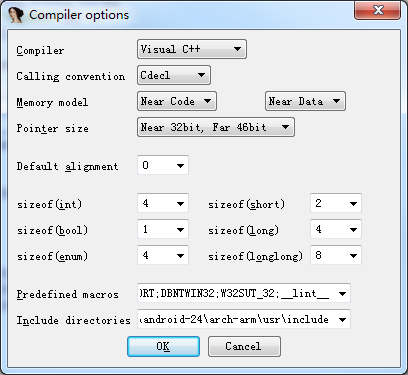
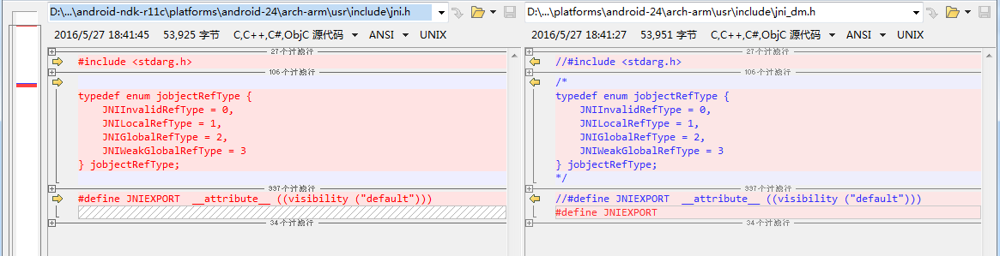

# IDApro

## 1. 导入jni.h

1. IDAPro 设置 compiler

  

(1) 选择Visual C++  
(2) Include directories 填入NDK中包含jni.h 的路径和VS2008中VC的include路径，两个路径间用”;”分隔。  
(3) Predefined macros 加入 __lint__ 宏定义。  

2. 修改 jni.h

(1) 注释掉 #include<stdarg.h>   
(2) 注释掉 
	
	typedef enum jobjectRefType {
	    JNIInvalidRefType = 0,
	    JNILocalRefType = 1,
	    JNIGlobalRefType = 2,
	    JNIWeakGlobalRefType = 3
	} jobjectRefType;

以及与之有关的引用

(3) 修改 `#define JNIEXPORT  __attribute__ ((visibility ("default"))) ` 为 `#define JNIEXPORT`

3. 选择菜单 File -> Load file -> Parse C header file(Ctrl+F9) 导入刚才修改好的jni.h文件即可

如果还有其他错误，则根据错误提示进行修改

4. 切换到 Structures 窗口， 按insert键开始插入结构